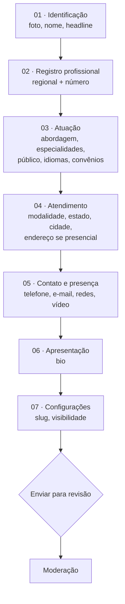
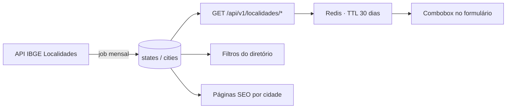

# Plataforma Confluências — Perfil do Profissional
## Especificação revisada: formulário de edição e página pública

**Versão:** 2.1 · **Data:** 14/08/2026
**Substitui:** seção 5 ("Formulário de Edição de Perfil Profissional") da especificação geral
**Telas afetadas:** `/painel/perfil` (edição) · `/profissionais/{slug}` (pública) · `/profissionais` (diretório, por consequência)

---

## 0. Princípio norteador desta revisão

> **Quanto menos a pessoa digitar, menor a chance de erro na busca.**

Este princípio deixa de ser recomendação e passa a ser **regra de arquitetura**:

**Todo campo que alimenta um filtro do diretório é dado estruturado — nunca texto livre.**

Texto livre sobrevive apenas onde o valor está na expressão pessoal: bio, headline, título de publicação. Em todo o resto, a pessoa **escolhe** de uma lista controlada, e o sistema **monta** o valor final.

O motivo é concreto. Se "cidade" é texto livre, o diretório acumula `Belo Horizonte`, `belo horizonte`, `BH`, `Belo Horizonte/MG` e `Belo Horizonte - Minas` como cinco cidades distintas. Nenhum filtro sobrevive a isso, e o problema só aparece quando já há trezentos perfis cadastrados — quando corrigir custa migração de dados e retrabalho de todo mundo.

### 0.1 Aplicação campo a campo

| Campo | Como era | Como fica | O que isso resolve |
|---|---|---|---|
| Registro profissional | Texto livre `CRP 00/00000` | Select de regional + número | Formato único; permite agrupar por regional |
| Estado | Select de UF | Select alimentado pelo IBGE | Código IBGE como chave, não sigla digitada |
| Cidade | Texto livre / select | Combobox dependente do estado (IBGE) | Fim das grafias divergentes; filtro confiável |
| Telefone | Texto com máscara BR | Select de país (DDI) + número | Aceita profissional fora do Brasil sem quebrar máscara |
| Redes sociais | URL completa | Só o `@usuário`, prefixo fixo na tela | Fim do link quebrado por colar URL de app |
| Idiomas | Multi-select opcional livre | Lista controlada e priorizada | Vira filtro real do diretório |
| Faixa de preço | Select opcional | **Removido** | Ver §1.1 |
| Vídeo | Não existia | URL de YouTube/Vimeo, com extração de ID | Apresentação sem custo de hospedagem |

---

## 1. Mudanças em relação à versão 1.0

### 1.1 Removido: faixa de preço por sessão

O campo sai do formulário, da página pública, dos filtros do diretório e do modelo de dados.

**Justificativa registrada** (coerente com a decisão já tomada em `direcao-de-design.md`, que tirou o preço da ficha do carrossel): manter preço em posição de destaque transforma a escolha de um profissional de saúde mental em comparação de tabela. Isso conflita com a Carta de Princípios do movimento e com o Código de Ética do CFP, que veda mercantilização da profissão. Quem quiser informar valor pode fazê-lo na bio, em linguagem própria e contextualizada ("atendo com valor social", "reservo vagas a preço reduzido").

**Impacto técnico:** remover coluna `price_range` de `profiles`; remover o filtro `precoMin/precoMax` da API de busca; remover o chip de preço do card de resultado.

**P-01 — decidido em 14/08 (v2.1): não.** A proposta de manter um selo "Ofereço vagas com valor social" foi recusada. Ela recriava, por outro nome, exatamente o que a remoção do preço buscava evitar: um atributo comercial que o visitante usa para comparar profissionais. As regras de publicidade do CFP não admitem esse tipo de atrativo. O campo não existe em nenhuma camada.

### 1.2 Adicionado: idiomas de atendimento — §4.4
### 1.3 Alterado: telefone com prefixo internacional — §4.3
### 1.4 Alterado: estado e cidade via API do IBGE — §4.2
### 1.5 Adicionado: vídeo de apresentação — §4.5
### 1.6 Alterado: redes sociais por nome de usuário — §4.6
### 1.7 Alterado: registro profissional composto — §4.1

### 1.8 Removido: bloco "Disponibilidade" (v2.1)

Saem do formulário, da página pública, dos filtros e do modelo de dados **os dois campos**
do bloco: "Aceito novos pacientes" e "Vagas com valor social".

**Justificativa registrada:** as regras de publicidade do CFP não permitem que o perfil
ofereça condições que funcionem como atrativo na escolha entre profissionais. Tanto a
sinalização de vaga quanto a de valor operam desse jeito — viram critério de comparação
e, na prática, disputa. Informação sobre agenda e sobre valor pertence à conversa entre
profissional e paciente, não à vitrine.

**Impacto técnico:** remover `accepting_patients`, `accepting_checked_at` e `social_fee`
de `profiles`; remover os dois filtros do diretório; remover os selos da página pública e
do card; **aposentar a sugestão §6.15** (revalidação de 90 dias), que existia apenas para
manter esse campo honesto.

### 1.9 Adicionado: WhatsApp com mensagem direta — §4.7

### 1.10 Adicionado: endereço com preenchimento automático — §4.8

### 1.11 Alterado: público atendido passa a ter dois eixos — §2.3.1

---

## 2. Estrutura do formulário `/painel/perfil`

Seis seções, nesta ordem. A ordem não é arbitrária: começa pelo que a pessoa sabe de cor (nome, registro), deixa a bio — o campo que exige mais esforço — para depois de já haver investimento no formulário, e termina em configurações técnicas.



**Salvamento:** rascunho automático a cada 20 s e ao sair de cada seção. Nada se perde se a aba fechar. O botão principal é **"Enviar para revisão"**; o secundário, **"Salvar rascunho"**.

### 2.1 Seção 01 — Identificação

| Campo | Tipo | Obrigatório | Origem | Validação |
|---|---|---|---|---|
| Foto de perfil | Upload + recorte 1:1 | Não¹ | — | JPG/PNG/WebP, máx. 5 MB, mín. 400×400 px |
| Nome profissional | Texto | Sim | — | 3–120 caracteres. Pode ser nome social |
| Headline | Texto | Não | — | Máx. 80 caracteres |
| Pronomes | Select | Não | Lista controlada | ela/dela · ele/dele · elu/delu · não informar |

¹ **Mudança:** a foto deixa de ser obrigatória. O design system já define o monograma em bloco de cor chapada como padrão de retrato, e ele é visualmente coerente. Exigir foto cria barreira para quem não tem retrato adequado à mão e não acrescenta confiança real — o que gera confiança é o registro validado.

### 2.2 Seção 02 — Registro profissional

Detalhado em §4.1.

| Campo | Tipo | Obrigatório | Origem |
|---|---|---|---|
| Conselho | Select | Sim | Lista fixa (MVP: só CRP) |
| Regional | Select | Sim | Tabela `professional_council_regions` (24 itens) |
| Número | Texto numérico | Sim | — |
| Registro resultante | Somente leitura | — | Concatenado ao vivo |

### 2.3 Seção 03 — Atuação

| Campo | Tipo | Obrigatório | Origem | Regra |
|---|---|---|---|---|
| Abordagem teórica | Multi-select (combobox) | Sim | Taxonomia `approaches` | 1 a 3 |
| Especialidades | Multi-select (combobox) | Sim | Taxonomia `specialties` | 1 a 8 |
| Público atendido | Multi-select em dois grupos | Sim | Taxonomia `audiences` | Mín. 1 no primeiro grupo. Ver §2.3.1 |
| Idiomas de atendimento | Multi-select | Sim | Tabela `languages` | Mín. 1. Português vem pré-marcado |
| Convênios aceitos | Multi-select | Não | Taxonomia `health_plans` | Inclui "Não atendo por convênio" |

#### 2.3.1 Público atendido — dois eixos, um campo

A lista anterior tinha um eixo só: faixa etária e formato. Populações específicas são
outro eixo — alguém atende adultos **e** é referência para pessoas refugiadas. Como são
perguntas diferentes, o campo se divide em dois grupos dentro do mesmo seletor.

| Grupo | Opções | Obrigatório |
|---|---|---|
| **Faixa etária e formato** | Crianças · Adolescentes · Adultos · Idosos · Casais · Famílias · Grupos | Sim, mín. 1 |
| **Populações que atendo** | Migrantes · Refugiadas e refugiados · Indígenas · Quilombolas · Brasileiras e brasileiros no exterior | Não |

O segundo grupo não é enfeite: é o eixo em que a Carta de Princípios do movimento vira
funcionalidade. Quem procura atendimento em contexto de deslocamento, ou dentro de
comunidade indígena ou quilombola, hoje não tem como filtrar isso em lugar nenhum.

**"Brasileiras e brasileiros no exterior"** conversa com um caso que o diretório já
declara atender ("Brasil e exterior"): profissional fora do país, ou dentro dele
atendendo quem está fora. Duas consequências práticas — o país do telefone deixa de ser
exceção (§4.3) e o endereço presencial precisa aceitar formato não brasileiro (§4.8).

**Nota de linguagem:** o rótulo é "populações que atendo", nunca "especialista em". A
segunda formulação é reivindicação de competência e recai nas regras de publicidade.

**Regra da taxonomia:** especialidades e abordagens saem de lista curada. Existe a opção **"Não encontrei minha abordagem"**, que abre um campo de sugestão. A sugestão **não entra na lista pública** — vai para uma fila de curadoria no admin. Isso impede que `TCC`, `T.C.C.` e `Terapia Cognitivo-Comportamental` virem três filtros diferentes.

### 2.4 Seção 04 — Atendimento

| Campo | Tipo | Obrigatório | Regra |
|---|---|---|---|
| Modalidade | Checkbox (2) | Sim | Online e/ou Presencial. Ao menos uma |
| Estado | Select (IBGE) | Sim | §4.2 |
| Cidade | Combobox dependente (IBGE) | Sim | §4.2 |
| Cidades adicionais | Combobox múltiplo | Não | Até 2. Para quem atende em mais de uma praça |
| País do endereço | Select | Condicional² | Padrão Brasil. Fora do Brasil, o CEP dá lugar a campos livres |
| CEP | Texto + máscara | Condicional² | Preenche logradouro, bairro, cidade e UF sozinho — §4.8 |
| Logradouro, número, complemento, bairro | Texto | Condicional² | — |
| Exibir endereço completo no perfil | Toggle | Não | Padrão: **não**. Se off, mostra só bairro + cidade |

² Obrigatório apenas se "Presencial" estiver marcado.

**Nota de privacidade:** muita gente atende em casa. O padrão precisa ser não expor o endereço; quem quiser expõe.

### 2.5 Seção 05 — Contato e presença

| Campo | Tipo | Obrigatório | Regra |
|---|---|---|---|
| Telefone principal | País + número | Sim | §4.3 |
| É WhatsApp | Checkbox | Não | Ativa botão dedicado no perfil — §4.7 |
| Mensagem inicial do WhatsApp | Texto | Não | Máx. 180 caracteres. Já vem escrita na conversa |
| Exibir telefone publicamente | Toggle | Não | Padrão: **não** — usa formulário de contato |
| Telefone secundário | País + número | Não | — |
| E-mail público | E-mail | Não | Diferente do e-mail de login |
| Site pessoal | URL | Não | Único campo que aceita URL completa |
| Redes sociais | 8 campos de handle | Não | §4.6 |
| Vídeo de apresentação | URL YouTube/Vimeo | Não | §4.5 |

### 2.6 Seção 06 — Apresentação

| Campo | Tipo | Obrigatório | Validação |
|---|---|---|---|
| Bio | Textarea com formatação leve | Sim | 100–2000 caracteres |

Formatação leve = negrito, itálico, lista e parágrafo. Sem títulos, sem imagens, sem links (evita bio virando página de vendas e mantém consistência tipográfica com o design system).

### 2.7 Seção 07 — Configurações

| Campo | Tipo | Obrigatório | Regra |
|---|---|---|---|
| Slug | Texto (auto, editável) | Sim | Gerado do nome; único; `[a-z0-9-]`; 3–60 caracteres |
| URL final | Somente leitura | — | `confluencias.org/profissionais/{slug}` + botão copiar |
| Perfil visível no diretório | Toggle | Sim | Permite pausar sem cancelar assinatura |

---

## 3. Modelo de dados — deltas

Convenção: **banco em `snake_case`**, **JSON da API em `camelCase`**.

```sql
-- ============ Tabelas de referência (populadas por seed/job) ============

CREATE TABLE professional_council_regions (
  id              SMALLINT PRIMARY KEY,        -- 1..24
  council         VARCHAR(8)  NOT NULL,        -- 'CRP'
  code            CHAR(2)     NOT NULL,        -- '01'..'24'
  label           VARCHAR(80) NOT NULL,        -- 'CRP 06 — São Paulo'
  jurisdiction    VARCHAR(60) NOT NULL,        -- 'SP' | 'PA/AP'
  state_codes     CHAR(2)[]   NOT NULL,        -- {'PA','AP'}
  active          BOOLEAN     NOT NULL DEFAULT TRUE
);

CREATE TABLE states (
  ibge_code   SMALLINT PRIMARY KEY,            -- 31
  uf          CHAR(2) UNIQUE NOT NULL,         -- 'MG'
  name        VARCHAR(60) NOT NULL,
  slug        VARCHAR(60) UNIQUE NOT NULL,
  region      VARCHAR(20) NOT NULL,
  synced_at   TIMESTAMPTZ NOT NULL
);

CREATE TABLE cities (
  ibge_code    INTEGER PRIMARY KEY,            -- 3106200
  state_code   SMALLINT NOT NULL REFERENCES states(ibge_code),
  name         VARCHAR(120) NOT NULL,
  slug         VARCHAR(140) NOT NULL,
  name_ascii   VARCHAR(120) NOT NULL,          -- para busca sem acento
  latitude     NUMERIC(9,6),                   -- fase 2, mapa
  longitude    NUMERIC(9,6),
  synced_at    TIMESTAMPTZ NOT NULL,
  UNIQUE (state_code, slug)
);
CREATE INDEX idx_cities_search ON cities USING gin (name_ascii gin_trgm_ops);

CREATE TABLE languages (
  code        VARCHAR(12) PRIMARY KEY,         -- ISO 639: 'pt','en','es','sgn-BR'
  name        VARCHAR(60) NOT NULL,
  priority    SMALLINT NOT NULL DEFAULT 100,   -- menor = aparece antes
  group_label VARCHAR(40),                     -- 'Mais faladas' | 'Línguas indígenas'
  active      BOOLEAN NOT NULL DEFAULT TRUE
);

CREATE TABLE social_networks (
  key           VARCHAR(20) PRIMARY KEY,       -- 'instagram'
  label         VARCHAR(40) NOT NULL,
  url_prefix    VARCHAR(80) NOT NULL,          -- 'https://instagram.com/'
  display_prefix VARCHAR(40) NOT NULL,         -- 'instagram.com/'
  handle_regex  VARCHAR(200) NOT NULL,
  active        BOOLEAN NOT NULL DEFAULT TRUE
);

-- ============ Alterações em profiles ============

ALTER TABLE profiles
  DROP COLUMN price_range,                     -- §1.1
  DROP COLUMN crp,
  DROP COLUMN crp_state,
  DROP COLUMN city,
  DROP COLUMN state,
  DROP COLUMN phone,

  ADD COLUMN council_region_id   SMALLINT NOT NULL REFERENCES professional_council_regions(id),
  ADD COLUMN council_number      VARCHAR(12) NOT NULL,
  ADD COLUMN council_full        VARCHAR(24) GENERATED ALWAYS AS
        ('CRP ' || lpad(council_region_id::text, 2, '0') || '/' || council_number) STORED,

  ADD COLUMN state_code          SMALLINT NOT NULL REFERENCES states(ibge_code),
  ADD COLUMN city_code           INTEGER  NOT NULL REFERENCES cities(ibge_code),

  ADD COLUMN phone_country       CHAR(2)     NOT NULL DEFAULT 'BR',
  ADD COLUMN phone_e164          VARCHAR(20) NOT NULL,
  ADD COLUMN phone_is_whatsapp   BOOLEAN     NOT NULL DEFAULT FALSE,
  ADD COLUMN phone_public        BOOLEAN     NOT NULL DEFAULT FALSE,
  ADD COLUMN whatsapp_message    VARCHAR(180),
  ADD COLUMN phone2_country      CHAR(2),
  ADD COLUMN phone2_e164         VARCHAR(20),

  ADD COLUMN video_provider      VARCHAR(12),  -- 'youtube' | 'vimeo'
  ADD COLUMN video_id            VARCHAR(40),
  ADD COLUMN video_title         VARCHAR(120),

  ADD COLUMN pronouns            VARCHAR(20),
  ADD COLUMN address_country     CHAR(2) NOT NULL DEFAULT 'BR',
  ADD COLUMN address_public      BOOLEAN NOT NULL DEFAULT FALSE,
  ADD COLUMN listed              BOOLEAN NOT NULL DEFAULT TRUE;

CREATE UNIQUE INDEX uq_profiles_council
  ON profiles (council_region_id, council_number);       -- um registro, um perfil

-- ============ Relacionamentos N:N ============

CREATE TABLE profile_languages (
  profile_id  UUID REFERENCES profiles(id) ON DELETE CASCADE,
  language_code VARCHAR(12) REFERENCES languages(code),
  PRIMARY KEY (profile_id, language_code)
);

CREATE TABLE profile_cities (                  -- cidades adicionais de atendimento
  profile_id  UUID REFERENCES profiles(id) ON DELETE CASCADE,
  city_code   INTEGER REFERENCES cities(ibge_code),
  PRIMARY KEY (profile_id, city_code)
);

CREATE TABLE audiences (                        -- público atendido, dois eixos
  id          SMALLINT PRIMARY KEY,
  axis        VARCHAR(12) NOT NULL,              -- 'etaria' | 'populacao'
  name        VARCHAR(60) NOT NULL,
  slug        VARCHAR(60) UNIQUE NOT NULL,
  priority    SMALLINT NOT NULL DEFAULT 100,
  active      BOOLEAN NOT NULL DEFAULT TRUE
);

CREATE TABLE profile_audiences (
  profile_id  UUID REFERENCES profiles(id) ON DELETE CASCADE,
  audience_id SMALLINT REFERENCES audiences(id),
  PRIMARY KEY (profile_id, audience_id)
);

CREATE TABLE profile_socials (
  profile_id  UUID REFERENCES profiles(id) ON DELETE CASCADE,
  network_key VARCHAR(20) REFERENCES social_networks(key),
  handle      VARCHAR(120) NOT NULL,
  PRIMARY KEY (profile_id, network_key)
);
```

**Sobre o índice único de registro:** dois perfis não podem declarar o mesmo CRP. Isso não valida que o registro é real — valida que ninguém duplica. A validação de existência entra na fase 2 com o selo verificado.

---

## 4. Especificação dos componentes novos

### 4.1 Registro profissional composto

#### Comportamento

Três elementos numa linha, com um quarto de leitura:

```
Conselho          Regional                             Número
[ CRP        v ]  [ CRP 06 — São Paulo            v ]  [ 123456        ]

Seu registro: CRP 06/123456
```

1. **Conselho** — no MVP só existe `CRP`. O select fica visível mesmo assim, desabilitado com valor único, porque a plataforma vai abrir para outras profissões de saúde mental (CRESS, CRM/psiquiatria) e a estrutura precisa já estar pronta. **Alternativa:** ocultar até haver o segundo conselho. *Ponto de decisão P-02.*
2. **Regional** — combobox com busca. Digitar "minas" encontra `CRP 04 — Minas Gerais`; digitar "04" também.
3. **Número** — `inputmode="numeric"`, aceita só dígitos, colagem sanitizada (remove pontos, traços, "CRP", espaços).
4. **Pré-visualização** — atualiza a cada tecla. É o que a pessoa vai ver publicado.

#### Pré-seleção inteligente

Se o estado de atendimento já foi preenchido, a regional correspondente vem **pré-selecionada** (mudável). Menos um clique para a maioria.

#### Regra de coerência (aviso, não bloqueio)

Se a UF da regional não corresponder à UF de atendimento, exibir aviso não bloqueante:

> A sua regional é do Paraná, mas você atende em São Paulo. Se você se mudou e ainda não transferiu o registro, está tudo certo — é só conferir se o número está correto.

Bloquear seria errado: transferência de inscrição demora, e há quem atenda online a partir de outro estado.

#### Tabela de referência — 24 regionais

Conforme o Conselho Federal de Psicologia:

| Código | Jurisdição | | Código | Jurisdição |
|---|---|---|---|---|
| CRP 01 | Distrito Federal | | CRP 13 | Paraíba |
| CRP 02 | Pernambuco | | CRP 14 | Mato Grosso do Sul |
| CRP 03 | Bahia | | CRP 15 | Alagoas |
| CRP 04 | Minas Gerais | | CRP 16 | Espírito Santo |
| CRP 05 | Rio de Janeiro | | CRP 17 | Rio Grande do Norte |
| CRP 06 | São Paulo | | CRP 18 | Mato Grosso |
| CRP 07 | Rio Grande do Sul | | CRP 19 | Sergipe |
| CRP 08 | Paraná | | CRP 20 | Amazonas e Roraima |
| CRP 09 | Goiás | | CRP 21 | Piauí |
| CRP 10 | Pará e Amapá | | CRP 22 | Maranhão |
| CRP 11 | Ceará | | CRP 23 | Tocantins |
| CRP 12 | Santa Catarina | | CRP 24 | Acre e Rondônia |

#### Validação

| Regra | Mensagem |
|---|---|
| Regional obrigatória | "Selecione a sua regional." |
| Número obrigatório | "Informe o número do seu registro." |
| Só dígitos | (sanitizado automaticamente, sem erro) |
| 4 a 7 dígitos | "O número do registro deve ter entre 4 e 7 dígitos." |
| Combinação única | "Este registro já está vinculado a outro perfil. Se você acredita que houve engano, fale com a gente." |

**Premissa PR-01:** a faixa de 4 a 7 dígitos é estimativa. Alguns registros trazem sufixos (dígito verificador, indicação de especialista). Antes do desenvolvimento, coletar 20 a 30 registros reais de regionais diferentes e ajustar a regra. **Na dúvida, ser permissivo** — recusar um registro válido é pior do que aceitar um inválido, já que existe moderação humana depois.

#### JSON

```json
{
  "council": "CRP",
  "councilRegionId": 6,
  "councilNumber": "123456",
  "councilFull": "CRP 06/123456"
}
```

---

### 4.2 Estado e cidade via IBGE

#### Arquitetura — não consumir o IBGE no navegador

O front **nunca** chama `servicodados.ibge.gov.br` diretamente. Um job sincroniza os dados para as tabelas `states` e `cities`, e a API própria os serve.



Quatro razões: a plataforma não fica refém da disponibilidade do IBGE num momento de conversão; os slugs ficam estáveis (`belo-horizonte` gerado uma vez, não a cada requisição); dá para contar profissionais por cidade e ordenar por relevância; e o payload servido é enxuto (o IBGE devolve muito campo que não interessa).

**Endpoints de origem:**
- `https://servicodados.ibge.gov.br/api/v1/localidades/estados?orderBy=nome`
- `https://servicodados.ibge.gov.br/api/v1/localidades/estados/{UF}/municipios`

**Job:** mensal, mais execução manual sob demanda. Municípios mudam raramente, mas mudam. O job **nunca apaga** cidade que tenha perfil vinculado — apenas marca como inativa e alerta o admin.

#### Comportamento na tela

- **Estado**: combobox com as 27 UFs. Busca por nome ou sigla ("mg", "minas").
- **Cidade**: desabilitado até haver estado. Rótulo do estado vazio: *"Escolha o estado primeiro"*.
- Busca **sem acento e sem caixa** — digitar "sao paulo" encontra "São Paulo"; "aracatuba" encontra "Araçatuba".
- Nunca renderizar 853 municípios de uma vez (Minas Gerais). Lista virtualizada, ou mostrar as 8 mais populosas do estado até a pessoa digitar duas letras.
- Se o estado mudar depois da cidade escolhida, limpar a cidade e avisar: *"Escolha a cidade do novo estado."*
- **Mobile:** o combobox abre em folha de tela cheia com campo de busca no topo, não como select nativo.

#### Ganho no diretório

Com código IBGE como chave, o diretório ganha URLs indexáveis e estáveis:

```
/profissionais/mg                              → todos em Minas Gerais
/profissionais/mg/belo-horizonte               → cidade
/profissionais/mg/belo-horizonte/psicanalise   → cidade + abordagem
```

São exatamente as buscas que trazem tráfego orgânico ("psicólogo em Belo Horizonte"). Sem dado estruturado, essas páginas não existem.

#### JSON

```json
{
  "stateCode": 31,
  "cityCode": 3106200,
  "additionalCityCodes": [3118601],
  "location": {
    "state": { "code": 31, "uf": "MG", "name": "Minas Gerais", "slug": "minas-gerais" },
    "city":  { "code": 3106200, "name": "Belo Horizonte", "slug": "belo-horizonte" }
  }
}
```

---

### 4.3 Telefone com prefixo internacional

#### Comportamento

```
[ 🇧🇷 +55  v ] [ (31) 99999-9999          ]
                 ☑ Este número tem WhatsApp
                 ☐ Exibir o número no meu perfil público
```

- **Select de país**: bandeira, nome e DDI. Padrão `Brasil +55`. Os países aparecem em duas faixas — primeiro os prováveis (Brasil, Portugal, Estados Unidos, Argentina, Espanha, Reino Unido, Alemanha, França, Itália, Japão), depois todos em ordem alfabética.
- **Máscara dinâmica**: muda conforme o país. Brasil `(##) #####-####`; demais países usam formatação internacional genérica. Usar **libphonenumber-js** — não escrever máscara à mão, e não bloquear a digitação: formatar enquanto digita e validar ao sair do campo.
- **Colagem inteligente**: se a pessoa colar `+351 912 345 678`, o sistema troca o país para Portugal sozinho e preenche o número. Se colar `5531999999999`, reconhece o `55`.
- **Armazenamento em E.164**: `+5531999999999`. O formato legível é gerado na renderização, conforme o país.

#### Validação

| Regra | Mensagem |
|---|---|
| Obrigatório | "Informe um telefone para contato." |
| Válido para o país | "Esse número não parece válido para o Brasil. Confira o DDD e a quantidade de dígitos." |
| WhatsApp exige celular | "Para marcar como WhatsApp, informe um número de celular." |

#### Privacidade — decisão de projeto

O padrão é **não exibir** o número. O perfil público mostra o botão "Falar com [nome]", que abre o formulário de contato. Quem marcar a exibição tem o número revelado **só depois de um clique** ("Ver telefone") — nunca em texto puro no HTML.

Isso resolve três coisas ao mesmo tempo: reduz raspagem por robôs de spam, atende ao princípio da minimização da LGPD, e gera o evento que alimenta a métrica "contatos recebidos" do painel do profissional.

O botão de WhatsApp obedece à mesma regra e por um motivo que não é óbvio — ver §4.7.

#### JSON

```json
{
  "phone": {
    "country": "BR",
    "dialCode": "+55",
    "e164": "+5531999999999",
    "formatted": "(31) 99999-9999",
    "isWhatsapp": true,
    "isPublic": false
  }
}
```

---

### 4.4 Idiomas de atendimento

#### Comportamento

Multi-select com busca, agrupado. A lista abre já mostrando o grupo prioritário — sem digitar nada, a pessoa resolve em um clique:

```
IDIOMAS DE ATENDIMENTO
[ Português ×] [ Libras ×]  ⌄

  ── Mais faladas no Brasil ──
  ☑ Português          ☐ Inglês
  ☐ Espanhol           ☑ Libras
  ── Também comuns ──
  ☐ Francês  ☐ Italiano  ☐ Alemão  ☐ Japonês  ☐ Árabe  ☐ Mandarim
  ── Línguas indígenas ──
  ☐ Guarani  ☐ Nheengatu  ☐ Tikuna  ☐ Kaingang  ☐ Terena
  ── Outras (busque acima) ──
```

**Português vem pré-marcado**, removível. Mínimo de um idioma.

#### Sobre Libras

Libras entra no grupo prioritário, não como acessório. É língua oficial reconhecida (Lei 10.436/2002), a comunidade surda enfrenta escassez crítica de atendimento psicológico, e o filtro "atende em Libras" é dos poucos que muda concretamente a vida de quem busca. Deve aparecer como selo destacado no perfil e no card do diretório.

#### Sobre línguas indígenas

A Carta de Princípios do movimento afirma o compromisso com cosmopercepções indígenas e afro-brasileiras. Manter só "Português, Inglês, Espanhol" contradiz o documento fundador. A lista sugerida acima é um ponto de partida.

**Ponto de decisão P-03:** a curadoria dessa lista não deve ser feita por quem escreve a especificação. Levar a lista de línguas indígenas para validação com pessoas do movimento antes do seed.

#### Seed inicial (`languages`)

| code | name | priority | group_label |
|---|---|---|---|
| `pt` | Português | 1 | Mais faladas no Brasil |
| `sgn-BR` | Libras | 2 | Mais faladas no Brasil |
| `en` | Inglês | 3 | Mais faladas no Brasil |
| `es` | Espanhol | 4 | Mais faladas no Brasil |
| `fr` | Francês | 20 | Também comuns |
| `it` | Italiano | 21 | Também comuns |
| `de` | Alemão | 22 | Também comuns |
| `ja` | Japonês | 23 | Também comuns |
| `ar` | Árabe | 24 | Também comuns |
| `zh` | Mandarim | 25 | Também comuns |
| `gn` | Guarani | 40 | Línguas indígenas |
| `yrl` | Nheengatu | 41 | Línguas indígenas |
| … | … | … | … |

Ordenação: `priority ASC, name ASC`.

#### JSON

```json
{ "languageCodes": ["pt", "sgn-BR", "es"] }
```

---

### 4.5 Vídeo de apresentação

#### Comportamento

Um campo só. A pessoa cola o link do YouTube ou Vimeo; o sistema identifica plataforma e ID, e mostra a miniatura na hora:

```
VÍDEO DE APRESENTAÇÃO — opcional
[ https://youtu.be/dQw4w9WgXcQ                    ]
✓ Vídeo do YouTube reconhecido
┌──────────────┐
│  ▶ miniatura │  "Apresentação — Ana Lima"
└──────────────┘  [Remover]
```

#### Formatos aceitos

| Entrada | Plataforma | ID extraído |
|---|---|---|
| `youtube.com/watch?v=ABC123` | youtube | `ABC123` |
| `youtu.be/ABC123` | youtube | `ABC123` |
| `youtube.com/shorts/ABC123` | youtube | `ABC123` |
| `youtube.com/embed/ABC123` | youtube | `ABC123` |
| `vimeo.com/123456789` | vimeo | `123456789` |
| `player.vimeo.com/video/123456789` | vimeo | `123456789` |

Parâmetros extras (`?t=`, `&list=`, UTM) são descartados. **Nunca armazenar a URL colada** — só plataforma e ID. Isso garante que o embed sempre seja montado do jeito certo, independentemente do que foi colado.

#### Sem upload direto no MVP

Upload de vídeo significa armazenamento, transcodificação, CDN, custo por GB e moderação de mídia pesada. Fora do escopo do MVP. **Ponto de decisão P-04:** reavaliar na fase 2, provavelmente terceirizando (Mux, Cloudflare Stream).

#### Renderização — fachada, não iframe direto

A página pública **não** carrega o iframe de imediato. Mostra a miniatura hospedada na própria plataforma e só injeta o player após o clique.

Três razões: o iframe do YouTube grava cookie de terceiro antes de qualquer consentimento, o que é problema de LGPD; carregar o player custa cerca de 500 KB e derruba o LCP da página; e o vídeo é conteúdo secundário — quase ninguém que abre o perfil vai assistir.

Quando o embed for carregado, usar `youtube-nocookie.com`.

#### Orientação ao profissional (texto de apoio no campo)

> Um vídeo curto, de 60 a 90 segundos, funciona melhor do que um longo. Quem está procurando atendimento quer ouvir a sua voz e entender como você trabalha. **Se puder, ative as legendas** — muita gente assiste sem som, e legenda é acessibilidade.

#### Campos derivados

- `video_title`: buscado via oEmbed no salvamento (`https://www.youtube.com/oembed?url=...&format=json`), com o profissional podendo sobrescrever. Serve de texto alternativo e alimenta o `schema.org/VideoObject`.

#### Moderação

Vídeo é conteúdo público e passa por moderação como o resto do perfil. Trocar só o vídeo **não derruba o perfil do ar** — ver §6.4.

#### Validação

| Regra | Mensagem |
|---|---|
| URL reconhecível | "Não reconhecemos esse link. Cole o endereço de um vídeo do YouTube ou do Vimeo." |
| Vídeo existe (oEmbed 200) | "Esse vídeo não foi encontrado. Ele pode ter sido removido ou estar privado." |
| Não pode ser privado | "Esse vídeo é privado. Deixe-o como público ou não listado para que apareça no seu perfil." |

#### JSON

```json
{
  "video": {
    "provider": "youtube",
    "videoId": "dQw4w9WgXcQ",
    "title": "Apresentação — Ana Lima",
    "thumbnailUrl": "https://cdn.confluencias.org/video-thumbs/abc.webp"
  }
}
```

---

### 4.6 Redes sociais por nome de usuário

#### O problema que isso resolve

Pedir URL completa gera, na prática: link do app (`instagram://user?username=...`), link com rastreio (`?igshid=...`), perfil colado sem `https://` (vira caminho relativo e quebra), e URL de post em vez de perfil. Todo caso desses vira link quebrado numa página pública — e ninguém percebe até um paciente reclamar.

#### Comportamento

O prefixo é **texto fixo dentro do campo**, não editável. A pessoa digita apenas o usuário:

```
REDES SOCIAIS — opcional

Instagram   [ instagram.com/  | analima.psi          ]
LinkedIn    [ linkedin.com/in/| ana-lima-psicologa   ]
YouTube     [ youtube.com/@   | analimapsi           ]
Lattes      [ lattes.cnpq.br/ | 1234567890123456     ]
```

#### Colagem tolerante

Se a pessoa colar a URL inteira, o sistema **extrai o usuário sozinho** e mostra o que fez:

| Colado | Guardado | Aviso |
|---|---|---|
| `https://www.instagram.com/analima.psi/` | `analima.psi` | "Guardamos só o seu usuário: **analima.psi**" |
| `@analima.psi` | `analima.psi` | (silencioso — remove o @) |
| `instagram.com/analima.psi?igshid=xyz` | `analima.psi` | "Removemos os códigos de rastreio do link." |
| `linkedin.com/in/ana-lima/` | `ana-lima` | (silencioso) |

Isso é o princípio em ação: a pessoa faz o que for mais fácil, e o sistema normaliza.

#### Tabela de redes

| Rede | Prefixo exibido | Regex do handle | URL final |
|---|---|---|---|
| Instagram | `instagram.com/` | `^[a-zA-Z0-9._]{1,30}$` | `https://instagram.com/{h}` |
| Facebook | `facebook.com/` | `^[a-zA-Z0-9.]{5,50}$` | `https://facebook.com/{h}` |
| LinkedIn | `linkedin.com/in/` | `^[a-zA-Z0-9\-]{3,100}$` | `https://linkedin.com/in/{h}` |
| YouTube | `youtube.com/@` | `^[a-zA-Z0-9._\-]{3,30}$` | `https://youtube.com/@{h}` |
| X (Twitter) | `x.com/` | `^[a-zA-Z0-9_]{1,15}$` | `https://x.com/{h}` |
| TikTok | `tiktok.com/@` | `^[a-zA-Z0-9._]{2,24}$` | `https://tiktok.com/@{h}` |
| Threads | `threads.net/@` | `^[a-zA-Z0-9._]{1,30}$` | `https://threads.net/@{h}` |
| Lattes | `lattes.cnpq.br/` | `^\d{16}$` | `http://lattes.cnpq.br/{h}` |

**Site pessoal** é a única exceção: aceita URL completa, porque o domínio é arbitrário. Validar esquema `https://`, normalizar sem barra final, e verificar que resolve (HEAD com timeout de 3 s) no salvamento — se não resolver, avisar sem bloquear.

**Lattes** merece estar na lista: o público desta plataforma é acadêmico e clínico, e currículo Lattes vale mais para credibilidade profissional aqui do que TikTok.

**Ponto de decisão P-05:** permitir página de empresa no LinkedIn (`/company/`)? Sugestão: não no MVP — o perfil é de pessoa.

#### Renderização

Links com `rel="me nofollow noopener"` e `target="_blank"`. O `rel="me"` é o padrão de verificação de identidade descentralizada — barato e útil.

#### Validação

| Regra | Mensagem |
|---|---|
| Formato inválido | "Esse usuário não parece válido para o Instagram. Use apenas letras, números, ponto e sublinhado." |
| URL de post, não perfil | "Esse link é de uma publicação, não de um perfil. Informe só o seu nome de usuário." |

#### JSON

```json
{
  "socials": {
    "instagram": "analima.psi",
    "linkedin": "ana-lima-psicologa",
    "lattes": "1234567890123456"
  },
  "website": "https://analima.com.br"
}
```

Na resposta pública, a API devolve já montado:

```json
{
  "socials": [
    { "network": "instagram", "label": "Instagram",
      "handle": "analima.psi", "url": "https://instagram.com/analima.psi" }
  ]
}
```

O front nunca monta URL — quem monta é o back, com base na tabela `social_networks`. Se o Instagram mudar de domínio, muda-se uma linha no banco.

---

### 4.7 WhatsApp: conversa direta sem expor o número

#### Comportamento

Marcado "este número tem WhatsApp", a página pública ganha um botão que abre a conversa
já iniciada, com uma mensagem pronta:

```
[ Enviar mensagem ]          ← formulário da plataforma
[ Chamar no WhatsApp ]       ← abre a conversa direto
```

A profissional pode escrever a **mensagem inicial** (até 180 caracteres). Padrão sugerido:

> Olá, {nome}. Encontrei seu perfil no Confluências e gostaria de saber sobre atendimento.

Serve a quem chega: a maior parte das pessoas trava na primeira frase, e uma mensagem já
escrita reduz o atrito de fazer contato quando o assunto é difícil de nomear.

#### A armadilha: `wa.me` vaza o número

O caminho óbvio seria montar `https://wa.me/5531999999999?text=...` no `href`. Isso
**anula** a proteção da §4.3: o número volta a ficar em texto puro no HTML, ao alcance de
qualquer raspador, mesmo quando a profissional escolheu não exibi-lo.

**A solução é um redirecionamento no servidor.** O botão aponta para uma rota da própria
plataforma, que responde 302 para o `wa.me`:

```
GET /api/v1/profissionais/{slug}/whatsapp
  → 302 Location: https://wa.me/5531999999999?text=Ol%C3%A1%2C%20Ana...
```

Três ganhos de uma vez: o número nunca está na página, o clique vira evento de contato no
painel da profissional, e trocar de número não invalida link nenhum. A rota tem limite de
taxa por sessão, como a de revelar telefone.

#### Regras

- O botão só aparece com `phone_is_whatsapp = true`.
- Se `phone_public = false`, o botão continua funcionando — a proteção está no
  redirecionamento, não na omissão do botão.
- A mensagem inicial é escapada em URL. Nada de HTML, nada de link.
- **Nenhum texto que prometa retorno rápido** ("respondo em minutos"): é promessa de
  serviço e cai nas regras de publicidade do CFP, pela mesma lógica de §1.8.

#### JSON

```json
{
  "phone": { "isWhatsapp": true, "isPublic": false },
  "whatsappMessage": "Olá, Ana. Encontrei seu perfil no Confluências e gostaria de saber sobre atendimento."
}
```

Na resposta pública, o número não aparece:

```json
{
  "contact": {
    "hasWhatsapp": true,
    "whatsappUrl": "/api/v1/profissionais/ana-lima/whatsapp",
    "phoneVisible": false
  }
}
```

---

### 4.8 Endereço com preenchimento automático

#### Quando aparece

O bloco de endereço fica oculto até "Presencial" ser marcado. Ao marcar, ele **abre e
recebe o foco**, com aviso em `aria-live` — quem usa leitor de tela precisa saber que
surgiram campos novos, e quem usa mouse não deve ter que caçá-los.

Desmarcar "Presencial" **não apaga** o que foi digitado: esconde. Quem desmarca por
engano não perde o trabalho.

#### CEP como chave — ViaCEP

Um campo resolve quatro. Digitado o CEP completo (8 dígitos), a consulta preenche
logradouro, bairro, cidade e UF; o cursor pula para o número, que é o único dado que o
CEP não tem.

**Por que ViaCEP e não Google Places:** é gratuito, não exige chave nem cartão, cobre o
Brasil inteiro e devolve exatamente os campos do formulário. O Places cobra por
requisição e resolveria um problema que a plataforma não tem no MVP.

```
GET https://viacep.com.br/ws/30140071/json/
→ { "logradouro": "Rua da Bahia", "bairro": "Centro",
    "localidade": "Belo Horizonte", "uf": "MG" }
```

**Consumir pelo próprio back-end**, não pelo navegador: permite cache (CEP muda pouco),
não expõe a plataforma à indisponibilidade do serviço em pleno preenchimento, e evita
uma chamada a terceiro sem consentimento prévio.

```
GET /api/v1/localidades/cep/{cep}
```

**Coerência com o §4.2:** o retorno do CEP traz *nome* de cidade, não código IBGE. O
back-end cruza `localidade` + `uf` com a tabela `cities` e devolve o código. Sem esse
cruzamento, "Belo Horizonte" viria como texto e reabriria o problema que a §4.2 fecha.
Se o cruzamento falhar (grafia divergente, município novo), o campo de cidade continua
como combobox para escolha manual — nunca preenchido com texto solto.

**Divergência com a cidade de atendimento:** se o CEP apontar para cidade diferente da
já escolhida, perguntar em vez de sobrescrever — "Este CEP fica em Contagem. Quer trocar
a cidade de atendimento?".

#### Endereço fora do Brasil

Com `address_country ≠ BR`, o CEP some e o formulário vira campos livres (linha 1, linha
2, cidade, região, código postal). Não vale inventar validação para 190 países.

**Ponto de decisão P-09:** autocompletar endereço internacional (Google Places, Mapbox
ou Photon/Nominatim) entra em qual fase? Sugestão: fase 2, junto do mapa — que precisa de
coordenadas de qualquer jeito, e aí a conta passa a se justificar.

#### Validação

| Regra | Mensagem |
|---|---|
| CEP com 8 dígitos | "CEP inválido." |
| CEP não encontrado | "Não encontramos esse CEP. Você pode preencher o endereço à mão." |
| Serviço fora do ar | "A consulta de CEP está indisponível agora. Preencha o endereço à mão." |
| Número obrigatório | "Informe o número. Se não houver, escreva S/N." |

Em todos os casos de falha, **o formulário segue preenchível à mão**. Consulta de CEP é
conveniência, nunca dependência.

---

## 5. Página pública `/profissionais/{slug}`

### 5.1 Hierarquia

Sem faixa de preço, a ordem passa a ser: **quem é → como trabalha → onde e como atende → o que escreve → como falar**.

```
┌────────────────────────────────────────────────────────┐
│ § 01  IDENTIFICAÇÃO                                    │
│  [foto/monograma]  Ana Lima                            │
│                    Psicóloga clínica · Psicanálise     │
│                    CRP 04/123456                       │
│                    Belo Horizonte, MG · Online e       │
│                    presencial                          │
│                    [ Enviar mensagem ]                 │
│                    [ Chamar no WhatsApp ]              │
├────────────────────────────────────────────────────────┤
│ § 02  VÍDEO  (só se existir — fachada com miniatura)   │
├────────────────────────────────────────────────────────┤
│ § 03  SOBRE — bio                                      │
├────────────────────────────────────────────────────────┤
│ § 04  COMO ATENDO                                      │
│  Abordagem · Especialidades · Público · Idiomas ·      │
│  Convênios                                             │
├────────────────────────────────────────────────────────┤
│ § 05  ONDE ATENDO                                      │
│  Modalidade · cidades · endereço (se público)          │
├────────────────────────────────────────────────────────┤
│ § 06  PUBLICAÇÕES  (abas — só as que têm conteúdo)     │
│  Artigos · Notícias · Referências · Eventos            │
├────────────────────────────────────────────────────────┤
│ § 07  CONTATO  formulário + redes sociais              │
└────────────────────────────────────────────────────────┘
```

**Mobile:** barra fixa no rodapé com "Falar com Ana" após a rolagem passar do bloco de identificação.

**Selos exibidos:** Atendimento online · Presencial · Atende em Libras · Perfil verificado (fase 2).

Todos descrevem **fato verificável ou modalidade**, nunca condição comercial nem
disponibilidade de agenda. É o critério que sobrou depois de §1.1 e §1.8, e é o critério
que deve valer para qualquer selo novo.

### 5.2 Regras de exibição

- Aba de publicação sem conteúdo **não aparece**. Se não houver nenhuma, a seção inteira some — melhor que "Nenhum artigo publicado".
- O botão de WhatsApp só aparece quando o número está marcado como tal, e sempre aponta para a rota de redirecionamento — nunca para `wa.me` direto.
- Idiomas só aparecem se houver mais de um, ou se incluir Libras (que sempre aparece).
- Telefone só aparece após clique, e apenas se `phone_public = true`.

### 5.3 Dados estruturados (SEO)

`schema.org/Person`, com:

```json
{
  "@context": "https://schema.org",
  "@type": "Person",
  "name": "Ana Lima",
  "jobTitle": "Psicóloga",
  "url": "https://confluencias.org/profissionais/ana-lima",
  "image": "https://cdn.confluencias.org/perfis/ana-lima.webp",
  "identifier": { "@type": "PropertyValue",
                  "propertyID": "CRP", "value": "CRP 04/123456" },
  "knowsLanguage": ["pt-BR", "sgn-BR"],
  "address": { "@type": "PostalAddress",
               "addressLocality": "Belo Horizonte",
               "addressRegion": "MG", "addressCountry": "BR" },
  "sameAs": ["https://instagram.com/analima.psi"],
  "subjectOf": { "@type": "VideoObject", "name": "Apresentação — Ana Lima" }
}
```

`identifier` com o CRP é o que sinaliza a buscadores que este é um profissional registrado, não um diretório genérico.

---

## 6. Sugestões de UX/UI

Ordenadas por relação entre impacto e esforço. As cinco primeiras valem o investimento no MVP.

### 6.1 Formulário em seções curtas, com salvamento contínuo — *alto impacto, esforço médio*

Sete seções em acordeão, uma aberta por vez, com salvamento automático. O perfil completo tem mais de 30 campos: apresentado como parede única, gera abandono; parcelado, cada seção parece resolvível em dois minutos.

Cada seção fechada mostra um resumo do que foi preenchido, para conferência sem reabrir.

### 6.2 Completude com consequência real — *alto impacto, esforço baixo*

Barra de progresso com uma promessa cumprida, não vaidade:

> **Perfil 70% completo** — perfis completos aparecem antes nos resultados de busca.
> Falta: vídeo de apresentação · idiomas · convênios

Isso precisa ser verdade: a ordenação padrão do diretório deve mesmo considerar completude. Incentivo honesto e alinhado — perfil completo é melhor para quem busca também.

### 6.3 Pré-visualização "ver como visitante" — *alto impacto, esforço baixo*

Botão persistente que abre o perfil público em nova aba, em modo rascunho. Em telas largas, painel lateral fixo com o card do diretório atualizando ao vivo — a pessoa vê exatamente como vai aparecer na busca. É o que mais motiva a completar o perfil.

### 6.4 Edição sem sair do ar — *alto impacto, esforço médio*

**O problema:** hoje, editar um perfil aprovado o joga de volta para moderação. Corrigir uma vírgula na bio tira a pessoa do diretório por dois dias. Ninguém edita o perfil nessas condições, e ele apodrece.

**A solução — versionamento:** a versão aprovada continua pública enquanto a nova aguarda revisão. O painel mostra:

> **No ar:** versão de 12/08 · **Em revisão:** alterações enviadas hoje ([ver o que mudou])

Além disso, **campos de baixo risco publicam na hora**, sem moderação: idiomas, convênios, aceita novos pacientes, redes sociais, cidade. Passam por revisão apenas: nome, registro, bio, foto, vídeo e headline — o que de fato pode conter problema ético ou publicitário.

Isso corta drasticamente o volume da fila de moderação e devolve autonomia ao profissional.

### 6.5 Moderação por diferença, não por perfil inteiro — *alto impacto, esforço médio*

No painel administrativo, mostrar só o que mudou, lado a lado, com botões por campo. Aprovar quatro de cinco alterações e devolver uma com comentário é mais rápido e menos frustrante que reprovar o perfil todo.

### 6.6 Combobox único, em vez de select longo — *impacto médio, esforço médio*

Um componente `Combobox` reutilizável (busca, teclado, ARIA `role="combobox"`, folha de tela cheia no mobile) atende cidade, idiomas, especialidades, abordagens, convênios, regional do CRP e país do telefone. Select nativo com 853 opções é inutilizável no celular.

### 6.7 Roteiro para a bio — *impacto médio, esforço baixo*

A bio é onde as pessoas travam. Em vez de textarea vazio com "mínimo 100 caracteres", oferecer três perguntas que viram parágrafos:

1. Como você trabalha? (sua abordagem, em palavras suas)
2. Com quem você mais atende?
3. O que alguém pode esperar da primeira sessão?

As respostas são pré-preenchidas no editor como parágrafos editáveis — a pessoa reescreve à vontade. Não é texto gerado automaticamente; é estrutura. E o contador de caracteres deve orientar qualidade, não só mínimo: *"Boas apresentações têm entre 600 e 1200 caracteres."*

### 6.8 Recorte de imagem embutido — *impacto médio, esforço baixo*

Enviar, arrastar, dar zoom, confirmar em 1:1. Sem isso, chega foto cortada na testa. Fallback: monograma no bloco de cor da paleta, conforme o design system.

### 6.9 Contato protegido — *impacto médio, esforço baixo*

Telefone e e-mail nunca em texto puro no HTML. Revelados por clique, via endpoint autenticado por sessão e com limite de taxa. Protege contra raspagem, atende à minimização da LGPD e gera o evento que alimenta a métrica de contatos. **Vale igualmente para o botão de WhatsApp** — o `href` aponta para a rota da plataforma, não para `wa.me` (§4.7).

### 6.10 Um erro, um foco — *impacto médio, esforço baixo*

Ao submeter com erro: rolar até o primeiro campo inválido, colocar foco nele, e anunciar em `aria-live` a contagem ("3 campos precisam de atenção"). Validação de campo acontece ao sair dele, nunca a cada tecla — validar enquanto se digita é hostil.

### 6.11 Campos compostos acessíveis — *impacto médio, esforço baixo*

Registro e telefone são vários controles para um conceito. Agrupar em `<fieldset>` com `<legend>`, e usar `aria-describedby` apontando para a pré-visualização, para que o leitor de tela anuncie "CRP 04/123456" e não três campos soltos.

### 6.12 Compartilhamento do perfil — *impacto baixo, esforço baixo*

No painel: botão "Copiar link", QR Code para baixar (vale em cartão de visita e sala de espera) e prévia da imagem de compartilhamento (Open Graph) gerada a partir dos dados do perfil.

### 6.13 Estado vazio útil na página pública — *impacto baixo, esforço baixo*

Nada de "Nenhum artigo publicado" para o visitante. Seções vazias simplesmente não são renderizadas.

### 6.14 Descarte só com confirmação — *impacto baixo, esforço baixo*

Ao sair com alterações não salvas, oferecer voltar. Com salvamento automático, isso raramente aparece — mas precisa existir.

### 6.15 Endereço que aparece sozinho, no momento certo — *impacto médio, esforço baixo*

*(A sugestão anterior desta posição — revalidação de "aceita novos pacientes" a cada 90 dias — foi aposentada junto com o campo, em §1.8.)*

O bloco de endereço só existe para quem atende presencialmente, então mostrá-lo o tempo todo cobra atenção de metade das pessoas à toa. Ao marcar "Presencial", o bloco abre, rola até ficar visível e recebe foco, com anúncio em `aria-live`. Ao desmarcar, some **sem apagar** o que já foi digitado.

Somado ao preenchimento por CEP (§4.8), o endereço inteiro sai em dois campos digitados: CEP e número. É o princípio da §0 aplicado ao trecho mais tedioso do formulário.

### 6.16 Ordenar por relevância honesta — *impacto médio, esforço médio*

Sem preço para ordenar e sem destaque pago no MVP, a ordenação padrão do diretório precisa ser explícita e justa. Sugestão: **completude do perfil → atividade recente (publicações) → aleatoriedade estável com semente diária**.

A semente diária importa: sem ela, quem começa com "A" no nome fica sempre no topo e quem começa com "Z" nunca é visto. Girar a lista todo dia distribui visibilidade — e é coerente com a Carta de Princípios.

---

## 7. Validações consolidadas

| # | Campo | Regra | Mensagem |
|---|---|---|---|
| V01 | Nome profissional | Obrigatório, 3–120 | "Informe o nome que aparecerá no seu perfil." |
| V02 | Headline | Máx. 80 | "Máximo de 80 caracteres." |
| V03 | Foto | JPG/PNG/WebP, ≤5 MB, ≥400px | "Envie uma imagem JPG, PNG ou WebP de até 5 MB." |
| V04 | Regional | Obrigatória | "Selecione a sua regional." |
| V05 | Número do registro | 4–7 dígitos | "O número do registro deve ter entre 4 e 7 dígitos." |
| V06 | Registro | Único na base | "Este registro já está vinculado a outro perfil." |
| V07 | Abordagem | 1 a 3 | "Selecione de 1 a 3 abordagens." |
| V08 | Especialidades | 1 a 8 | "Selecione ao menos uma especialidade." |
| V09 | Público atendido | Mín. 1 em faixa etária/formato | "Selecione ao menos uma faixa etária ou formato de atendimento." |
| V10 | Idiomas | Mín. 1 | "Selecione ao menos um idioma de atendimento." |
| V11 | Modalidade | Mín. 1 | "Marque se você atende online, presencialmente, ou os dois." |
| V12 | Estado | Obrigatório | "Selecione o estado." |
| V13 | Cidade | Obrigatória, pertencente ao estado | "Selecione a cidade." |
| V14 | Endereço | Obrigatório se presencial | "Para atendimento presencial, informe o endereço." |
| V15 | CEP | 8 dígitos | "CEP inválido." |
| V16 | Telefone | Obrigatório, válido no país | "Esse número não parece válido para o país selecionado." |
| V17 | WhatsApp | Precisa ser celular | "Para marcar como WhatsApp, informe um celular." |
| V18 | E-mail público | Formato válido | "E-mail inválido." |
| V19 | Site | https:// e resolve | "Não conseguimos acessar esse endereço. Confira o link." |
| V20 | Redes sociais | Regex por rede | "Esse usuário não parece válido para o {rede}." |
| V21 | Vídeo | YouTube ou Vimeo, público | "Cole o endereço de um vídeo público do YouTube ou do Vimeo." |
| V25 | Mensagem do WhatsApp | Máx. 180, sem link | "A mensagem inicial deve ter até 180 caracteres, sem links." |
| V26 | CEP não encontrado | — | "Não encontramos esse CEP. Você pode preencher o endereço à mão." |
| V27 | Número do endereço | Obrigatório se presencial | "Informe o número. Se não houver, escreva S/N." |
| V22 | Bio | 100–2000 | "A apresentação deve ter entre 100 e 2000 caracteres." |
| V23 | Slug | `[a-z0-9-]`, 3–60, único | "Endereço já em uso. Tente outro." |
| V24 | Envio para revisão | Todos os obrigatórios | "Faltam {n} campos obrigatórios para enviar seu perfil." |

**Tom das mensagens:** dizem o que fazer, não o que a pessoa errou. "Selecione a cidade" em vez de "Campo cidade é inválido".

---

## 8. API

### 8.1 Endpoints

| Método | Rota | Auth | Descrição |
|---|---|---|---|
| GET | `/api/v1/localidades/estados` | — | 27 UFs. Cache 30 d |
| GET | `/api/v1/localidades/estados/{uf}/cidades?q=` | — | Cidades, filtro opcional |
| GET | `/api/v1/localidades/cep/{cep}` | — | Endereço por CEP, com código IBGE resolvido |
| GET | `/api/v1/referencias/conselhos/regionais` | — | 24 regionais |
| GET | `/api/v1/referencias/idiomas` | — | Idiomas agrupados/ordenados |
| GET | `/api/v1/referencias/abordagens` | — | Taxonomia |
| GET | `/api/v1/referencias/especialidades` | — | Taxonomia |
| GET | `/api/v1/referencias/convenios` | — | Taxonomia |
| GET | `/api/v1/referencias/paises-telefone` | — | Países + DDI, priorizados |
| GET | `/api/v1/me/perfil` | Bearer | Perfil do usuário (rascunho + publicado) |
| PATCH | `/api/v1/me/perfil` | Bearer | Salvamento parcial (autosave) |
| POST | `/api/v1/me/perfil/enviar-revisao` | Bearer | Envia para moderação |
| POST | `/api/v1/me/perfil/video/validar` | Bearer | Valida URL e devolve metadados |
| POST | `/api/v1/me/perfil/foto` | Bearer | Upload (multipart) |
| GET | `/api/v1/me/perfil/slug-disponivel?slug=` | Bearer | Checagem em tempo real |
| GET | `/api/v1/profissionais/{slug}` | — | Perfil público |
| POST | `/api/v1/profissionais/{slug}/contato/revelar` | — | Revela telefone; registra evento |
| GET | `/api/v1/profissionais/{slug}/whatsapp` | — | 302 para `wa.me`; registra evento; número nunca no HTML |

### 8.2 `PATCH /api/v1/me/perfil` — requisição

```json
{
  "displayName": "Ana Lima",
  "headline": "Psicóloga clínica — Psicanálise",
  "pronouns": "ela/dela",
  "bio": "Atendo adultos há doze anos, com escuta orientada pela psicanálise...",

  "council": "CRP",
  "councilRegionId": 4,
  "councilNumber": "123456",

  "approachIds": [3],
  "specialtyIds": [7, 12, 19],
  "audienceIds": ["adultos", "casais", "migrantes", "refugiados"],
  "languageCodes": ["pt", "sgn-BR"],
  "healthPlanIds": [],

  "modalities": ["online", "presencial"],
  "stateCode": 31,
  "cityCode": 3106200,
  "additionalCityCodes": [3118601],
  "address": {
    "country": "BR",
    "zipCode": "30140071",
    "street": "Rua da Bahia",
    "number": "1200",
    "complement": "Sala 704",
    "district": "Centro",
    "isPublic": false
  },

  "phone": { "country": "BR", "e164": "+5531999999999",
             "isWhatsapp": true, "isPublic": false },
  "whatsappMessage": "Olá, Ana. Encontrei seu perfil no Confluências e gostaria de saber sobre atendimento.",
  "phone2": null,
  "publicEmail": "contato@analima.com.br",
  "website": "https://analima.com.br",
  "socials": { "instagram": "analima.psi", "lattes": "1234567890123456" },
  "video": { "provider": "youtube", "videoId": "dQw4w9WgXcQ" },

  "slug": "ana-lima",
  "listed": true
}
```

### 8.3 Resposta de sucesso

```json
{
  "data": {
    "id": "8f2c1e5a-...",
    "status": "rascunho",
    "completeness": 86,
    "missingFields": ["video", "healthPlanIds"],
    "publishedVersionAt": "2026-08-12T14:03:00Z",
    "updatedAt": "2026-08-14T09:21:44Z"
  }
}
```

### 8.4 Erro de validação — 422

```json
{
  "error": {
    "code": "VALIDATION_ERROR",
    "message": "Alguns campos precisam de atenção.",
    "fields": [
      { "field": "councilNumber", "rule": "length",
        "message": "O número do registro deve ter entre 4 e 7 dígitos." },
      { "field": "socials.instagram", "rule": "pattern",
        "message": "Esse usuário não parece válido para o Instagram." }
    ]
  }
}
```

O campo `field` usa notação de caminho (`socials.instagram`, `address.zipCode`) para o front mapear direto ao input.

### 8.5 `GET /api/v1/profissionais/{slug}` — resposta pública

```json
{
  "data": {
    "slug": "ana-lima",
    "displayName": "Ana Lima",
    "headline": "Psicóloga clínica — Psicanálise",
    "pronouns": "ela/dela",
    "photoUrl": "https://cdn.confluencias.org/perfis/ana-lima.webp",
    "monogramColor": "#A61F21",
    "council": { "label": "CRP 04/123456", "region": "Minas Gerais" },
    "verified": false,
    "bio": "<p>Atendo adultos há doze anos...</p>",
    "approaches": [{ "id": 3, "name": "Psicanálise", "slug": "psicanalise" }],
    "specialties": [{ "id": 7, "name": "Ansiedade", "slug": "ansiedade" }],
    "audiences": {
      "etaria": ["Adultos", "Casais"],
      "populacao": ["Migrantes", "Refugiadas e refugiados"]
    },
    "languages": [
      { "code": "pt", "name": "Português" },
      { "code": "sgn-BR", "name": "Libras", "highlight": true }
    ],
    "healthPlans": [],
    "modalities": ["online", "presencial"],
    "location": {
      "city": "Belo Horizonte", "citySlug": "belo-horizonte",
      "state": "MG", "stateSlug": "minas-gerais",
      "district": "Centro", "address": null
    },
    "additionalCities": [{ "name": "Contagem", "slug": "contagem" }],
    "contact": {
      "hasWhatsapp": true,
      "whatsappUrl": "/api/v1/profissionais/ana-lima/whatsapp",
      "phoneVisible": false,
      "publicEmail": "contato@analima.com.br",
      "website": "https://analima.com.br"
    },
    "socials": [
      { "network": "instagram", "label": "Instagram",
        "handle": "analima.psi", "url": "https://instagram.com/analima.psi" },
      { "network": "lattes", "label": "Currículo Lattes",
        "handle": "1234567890123456", "url": "http://lattes.cnpq.br/1234567890123456" }
    ],
    "video": {
      "provider": "youtube", "videoId": "dQw4w9WgXcQ",
      "title": "Apresentação — Ana Lima",
      "thumbnailUrl": "https://cdn.confluencias.org/video-thumbs/abc.webp",
      "embedUrl": "https://www.youtube-nocookie.com/embed/dQw4w9WgXcQ"
    },
    "contentCounts": { "articles": 4, "news": 0, "references": 7, "events": 1 },
    "updatedAt": "2026-08-12T14:03:00Z"
  }
}
```

Repare: `phone_e164` **não sai** na resposta pública. O número só existe na resposta de `/contato/revelar`.

---

## 9. Critérios de aceite

### CA-01 — Registro profissional composto
**Dado** que estou preenchendo meu perfil
**Quando** seleciono a regional "CRP 04 — Minas Gerais" e digito "123456"
**Então** vejo "CRP 04/123456" na pré-visualização
**E** ao salvar, o valor é armazenado como regional 4 e número 123456
**E** se outro perfil já usa esse registro, recebo erro sem que meus outros dados se percam.

### CA-02 — Cidade dependente do estado
**Dado** que o campo cidade está vazio e desabilitado
**Quando** seleciono "Minas Gerais"
**Então** o campo cidade é habilitado com os 853 municípios do estado
**E** ao digitar "belo" sem acento, "Belo Horizonte" aparece na lista
**E** se eu trocar o estado depois, a cidade é limpa com aviso.

### CA-03 — Telefone internacional
**Dado** que seleciono "Portugal +351"
**Quando** digito "912345678"
**Então** o número é aceito e armazenado como "+351912345678"
**E** a máscara aplicada corresponde ao formato português
**E** ao colar "+55 31 99999-9999", o país muda para Brasil automaticamente.

### CA-04 — Redes sociais por usuário
**Dado** que colo `https://www.instagram.com/analima.psi/?igshid=xyz`
**Quando** o campo perde o foco
**Então** o valor exibido passa a ser "analima.psi"
**E** vejo um aviso de que só o usuário foi guardado
**E** no perfil público o link aponta para `https://instagram.com/analima.psi`.

### CA-05 — Vídeo de apresentação
**Dado** que colo `https://youtu.be/dQw4w9WgXcQ`
**Então** vejo confirmação de reconhecimento e a miniatura
**E** ao salvar, são armazenados provedor e ID, não a URL colada
**E** na página pública o iframe só é injetado após eu clicar em reproduzir.

### CA-09 — WhatsApp sem expor o número
**Dado** que marquei "este número tem WhatsApp" e **não** marquei "exibir o número"
**Quando** um visitante abre o meu perfil e inspeciona o código da página
**Então** o número não aparece em lugar nenhum do HTML
**E** o botão aponta para `/api/v1/profissionais/{slug}/whatsapp`
**E** ao clicar, a conversa abre já com a mensagem inicial escrita
**E** o clique aparece como contato recebido no meu painel.

### CA-10 — Endereço por CEP
**Dado** que marquei "Presencial"
**Então** o bloco de endereço abre, rola até ficar visível e é anunciado por leitor de tela
**Quando** digito um CEP de 8 dígitos
**Então** logradouro, bairro, cidade e UF são preenchidos e o foco vai para o número
**E** se o CEP apontar para cidade diferente da que escolhi, sou perguntado antes de trocar
**E** se a consulta falhar, os campos continuam preenchíveis à mão.

### CA-11 — Ausência de disponibilidade e de valor
**Dado** que sou visitante
**Então** não encontro selo, filtro ou campo de "aceita novos pacientes" nem de "valor social"
**E** nenhum selo do perfil descreve condição comercial ou de agenda.

### CA-12 — Populações atendidas
**Dado** que marco "Refugiadas e refugiados" e "Indígenas"
**Então** os dois aparecem no meu perfil sob "Populações que atendo"
**E** o diretório permite filtrar por eles
**E** em nenhum lugar o texto diz "especialista em".

### CA-06 — Idiomas
**Dado** que abro o seletor de idiomas
**Então** "Português" já vem marcado
**E** o grupo "Mais faladas no Brasil" aparece primeiro, com Libras entre eles
**E** ao selecionar Libras, o selo "Atende em Libras" aparece no meu perfil e no card do diretório.

### CA-07 — Ausência de faixa de preço
**Dado** que sou visitante navegando no diretório
**Então** não encontro filtro de preço, nem valor no card, nem no perfil
**E** a busca funciona normalmente sem esse critério.

### CA-08 — Edição sem sair do ar
**Dado** que meu perfil está aprovado e público
**Quando** altero a bio e envio para revisão
**Então** a versão anterior continua visível para visitantes
**E** meu painel mostra "No ar: versão de {data} · Em revisão: alterações de hoje"
**E** ao alterar apenas idiomas, a mudança fica pública imediatamente, sem moderação.

---

## 10. Impacto no diretório

| Filtro | Situação |
|---|---|
| Faixa de preço | **Removido** |
| Estado / cidade | Reescrito para código IBGE |
| Idioma | **Novo** |
| Atende em Libras | **Novo** (atalho destacado) |
| Aceita novos pacientes | **Removido** — §1.8 |
| Vagas com valor social | Não implementado — §1.1 |
| Público: faixa etária e formato | **Novo** |
| Público: populações atendidas | **Novo** — migrantes, refugiadas(os), indígenas, quilombolas, brasileiras(os) no exterior |
| Abordagem, especialidade, modalidade, convênio | Sem mudança |

Novas rotas indexáveis: `/profissionais/{uf}`, `/profissionais/{uf}/{cidade}`, `/profissionais/{uf}/{cidade}/{abordagem}`.

---

## 11. Premissas e pontos de decisão

> **Sobre as regras de publicidade do CFP:** duas decisões desta versão (§1.1 e §1.8) se
> apoiam nelas. A especificação não reproduz o texto normativo nem cita artigos — a
> aplicação a um diretório online é interpretação, e interpretação de norma do conselho
> precisa vir de quem responde por ela. **Antes do desenvolvimento, submeter à validação
> de alguém do movimento com essa leitura**, junto com o próprio termo de uso da
> plataforma.

### Premissas (assumidas até confirmação)

| # | Premissa | Como verificar |
|---|---|---|
| PR-01 | Número de registro tem 4 a 7 dígitos, sem sufixo | Coletar 20–30 registros reais de regionais diferentes |
| PR-02 | O MVP atende apenas psicólogos com CRP | Confirmar com o movimento |
| PR-03 | A API de Localidades do IBGE é estável e pública | Testar; manter *seed* de contingência versionado |
| PR-04 | Um perfil = uma pessoa (não consultório/clínica) | Confirmar |
| PR-05 | O e-mail de login pode diferir do e-mail público | Confirmado pela especificação |
| PR-06 | Selo de modalidade e de idioma não configura publicidade vedada | Confirmar com quem acompanha o CFP |

### Pontos de decisão (precisam de resposta antes do desenvolvimento)

| # | Questão | Sugestão |
|---|---|---|
| P-01 | ~~Manter o selo "vagas com valor social"?~~ | **Decidido: não** (14/08) |
| P-02 | Exibir o select de conselho já no MVP, com só uma opção? | Ocultar até haver o segundo |
| P-03 | Quem cura a lista de línguas indígenas? | Levar ao movimento |
| P-04 | Upload direto de vídeo entra na fase 2? | Sim, terceirizado |
| P-05 | LinkedIn aceita página de empresa? | Não no MVP |
| P-06 | Quantas cidades adicionais são permitidas? | Duas |
| P-07 | A ordenação padrão do diretório considera completude? | Sim — ver §6.16 |
| P-08 | Quais campos publicam sem moderação? | Ver lista em §6.4 |
| P-09 | Autocomplete de endereço internacional entra em qual fase? | Fase 2, junto do mapa |
| P-10 | A mensagem inicial do WhatsApp passa por moderação? | Sim, junto com os campos de risco |
| P-11 | Quem valida a lista de populações atendidas? | Levar ao movimento, como as línguas indígenas |

---

## 12. Delta do backlog

| ID | Épico | História | Prioridade |
|---|---|---|---|
| US-031 | E1 | Componente de registro profissional composto (regional + número) | P0 |
| US-032 | E1 | Sincronização IBGE e API de localidades | P0 |
| US-033 | E1 | Combobox reutilizável com busca e acessibilidade | P0 |
| US-034 | E1 | Telefone com prefixo internacional (libphonenumber) | P0 |
| US-035 | E1 | Redes sociais por handle, com colagem tolerante | P0 |
| US-036 | E1 | Remoção da faixa de preço (modelo, form, filtros, cards) | P0 |
| US-037 | E1 | Idiomas de atendimento + selo de Libras | P0 |
| US-038 | E1 | Vídeo de apresentação com fachada e oEmbed | P1 |
| US-039 | E1 | Salvamento automático e formulário em seções | P1 |
| US-040 | E1 | Indicador de completude ligado à ordenação da busca | P1 |
| US-041 | E1 | Pré-visualização "ver como visitante" | P1 |
| US-042 | E6 | Versionamento de perfil e moderação por campo | P1 |
| US-043 | E1 | Recorte de imagem no envio da foto | P2 |
| US-044 | E2 | Revelação de contato com registro de evento | P1 |
| US-045 | E1 | Endereço por CEP com resolução de código IBGE | P0 |
| US-048 | E2 | WhatsApp por rota de redirecionamento, com mensagem inicial | P0 |
| US-049 | E1 | Público atendido em dois eixos, com populações específicas | P0 |
| US-050 | E1 | Remoção do bloco de disponibilidade em todas as camadas | P0 |
| US-046 | E1 | Roteiro assistido para a bio | P2 |
| US-047 | E5 | QR Code e prévia de compartilhamento do perfil | P2 |

---

## 13. Notas para desenvolvimento

**Nomenclatura:** banco em `snake_case`; JSON e TypeScript em `camelCase`; componentes React em `PascalCase`; arquivos de componente em `PascalCase.tsx`; hooks em `useAlgumaCoisa.ts`; rotas e slugs em `kebab-case`, sempre em português.

**Estrutura sugerida dos novos módulos:**

```
src/
├── components/perfil/
│   ├── CampoRegistroProfissional.tsx
│   ├── CampoLocalidade.tsx
│   ├── CampoTelefone.tsx
│   ├── CampoRedeSocial.tsx
│   ├── CampoVideo.tsx
│   ├── SeletorIdiomas.tsx
│   └── PreviaCardPerfil.tsx
├── components/ui/
│   └── Combobox.tsx
├── lib/
│   ├── telefone.ts          // libphonenumber-js
│   ├── redesSociais.ts      // extração e montagem de handle/URL
│   ├── video.ts             // parse de URL, oEmbed
│   └── registro.ts          // regionais, formatação, validação
├── server/jobs/
│   └── sincronizarIbge.ts
└── server/routes/
    ├── localidades.ts
    ├── referencias.ts
    └── perfil.ts
```

**Dependências novas:** `libphonenumber-js` (~145 kB, importar só metadados mínimos), `react-easy-crop` (recorte), `slugify`.

**Cuidado herdado do protótipo** (`telas-de-conta.md`, `painel-administrativo.md`): **não usar `style` inline para layout responsivo**. O erro de `grid-template-columns` inline vencendo media query já causou estouro horizontal duas vezes no protótipo. Layout responsivo vai em classe, sempre.

**Seeds obrigatórios antes do primeiro deploy:** `professional_council_regions` (24), `states` (27), `cities` (~5570), `languages`, `social_networks`, taxonomias de abordagem, especialidade, público e convênio.
